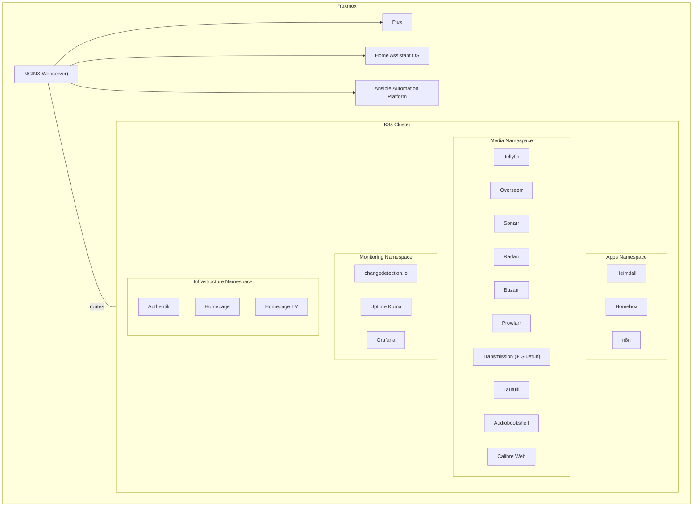

# kubernetes

Single-node K3s running a large part of my homelab on Kairos on Proxmox using Flux.

## Development workflow

### Bootstrap

Install the required tools locally:

```bash
./scripts/bootstrap-dev.sh
```

### Pre-commit

```bash
pre-commit install
pre-commit run --all-files
```

### Validate manifests

```bash
make validate
```

### Local smoke test

```bash
make smoke
```

### Network diagram


